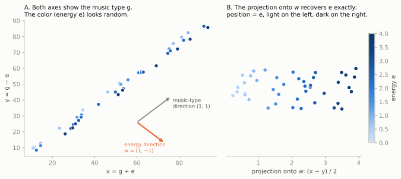
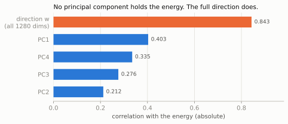
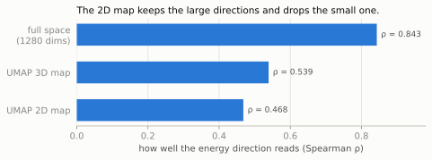
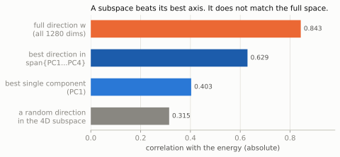

# How a Space Can Hold a Feature That No Axis Holds

*This document uses Simplified Technical English (ASD-STE100) where possible.
Some standard technical names are not STE words. The text defines them where
they occur.*

## 1. Purpose

The energy brief found the energy of a track as a direction in an embedding
(see `energy-scale-brief.md`, Section 4). This document explores the idea
behind that result.

The idea is this: a set of dimensions can hold a feature together, when no
single dimension holds it alone. The feature is not in a slot. The feature is
a pattern across the slots. This is what "abstract vector representation"
means in practice.

## 2. Two Views of a Feature

The common view says: a feature is a column in a table. The tempo is a
column. The year is a column. One number, one slot, one meaning.

The second view says: a feature is a direction in a space. To read the
feature of a point, you [project](https://en.wikipedia.org/wiki/Projection_(linear_algebra)) the point onto the direction. The projection
is a [weighted sum](https://en.wikipedia.org/wiki/Dot_product) of all the coordinates. The weights are the direction.

The first view is a special case of the second view. A column is a direction
that has one weight equal to 1 and all other weights equal to 0. The space
does not care which directions get names. The names are our choice of axes,
not a property of the data.

## 3. A Small Example That You Can Calculate by Hand

Make a space with two dimensions, `x` and `y`. Each point is a track. Each
track has a music type value `g` and an energy value `e`. The music type
causes large differences. The energy causes small differences.

Let the two coordinates mix the two causes:

```
x = g + e
y = g - e
```

Here are five tracks:

| Track | g | e | x | y |
|---|---|---|---|---|
| A | 10 | 1 | 11 | 9 |
| B | 10 | 3 | 13 | 7 |
| C | 50 | 1 | 51 | 49 |
| D | 50 | 3 | 53 | 47 |
| E | 90 | 2 | 92 | 88 |

Read the column `x`. It sorts the tracks as A, B, C, D, E. That is the music
type order, not the energy order. The column `y` gives the same order. Each
single axis is almost blind to the energy. The correlation of `x` with `e` is
near 0. The correlation of `y` with `e` is also near 0.

Now project each point onto the direction `(+1, -1)`:

```
x - y = (g + e) - (g - e) = 2e
```

| Track | x - y | e |
|---|---|---|
| A | 2 | 1 |
| B | 6 | 3 |
| C | 2 | 1 |
| D | 6 | 3 |
| E | 4 | 2 |

The projection recovers the energy exactly. The large cause `g` cancels. The
small cause `e` remains. No axis held the energy. The pair of axes held it
together, as a difference.



*Figure 1. The example of Section 3, drawn. In panel A, no axis sorts the
color. In panel B, the projection onto `w = (1, -1)` sorts it exactly.*

This is the full mechanism in two dimensions. The embedding does the same
thing in 1280 dimensions. The directions are not clean like `(+1, -1)`, and
the causes do not cancel exactly. But the principle is identical: the feature
lives in a combination, and a projection reads it out.

## 4. The Real Case: 1280 Dimensions

The library [embedding](https://en.wikipedia.org/wiki/Embedding_(machine_learning)) has 1280 dimensions. A [neural network](https://en.wikipedia.org/wiki/Artificial_neural_network) makes it. The
network learned to identify music types. Nobody trained it to measure energy.

But the energy is readable in its space. A [ridge regression](https://en.wikipedia.org/wiki/Ridge_regression) found a direction
`w`. The projection onto `w` agrees with the acoustic energy of Method 1 at a
held-out [Spearman correlation](https://en.wikipedia.org/wiki/Spearman%27s_rank_correlation_coefficient) of 0.843.

The direction is diagonal. The [principal components](https://en.wikipedia.org/wiki/Principal_component_analysis) show this. A principal
component is the axis with the largest spread, then the next largest, and so
on. If the energy were a clean axis, one component would hold it. Instead,
many components each hold a part:

| Component | Correlation with the energy | Part of the [total variance](https://en.wikipedia.org/wiki/Variance) |
|---|---|---|
| PC1 | +0.403 | 16.0% |
| PC4 | +0.335 | 5.4% |
| PC3 | -0.276 | 6.3% |
| PC2 | +0.212 | 8.9% |



*Figure 2. The parts and the whole. Each principal component holds a piece
of the energy. The full direction holds much more than any piece.*

These four components are the four with the largest spread. The table puts
them in the order of their correlation with the energy, not in the order of
their spread. We did not select them because of the energy.

Even the best component holds less than half of the signal. The full
direction across all 1280 dimensions holds 0.843. The whole is much more than
each part. That is the signature of a distributed feature.

## 5. Why a Network Stores Features This Way

A network must describe each track with a fixed number of dimensions. But the
world has more properties than the network has convenient axes: music type,
tone, tempo feel, voice, texture, era, energy, and more. The network cannot
give each property its own slot.

The solution is to share. Each dimension takes part in many properties. Each
property spreads across many dimensions. This works because a later stage can
always read a property back with a weighted sum. Storage as a pattern costs
nothing when the reader is a projection. The standard name for this is a
[*distributed representation*](https://en.wikipedia.org/wiki/Distributed_representation).

There is also a standard name for the reader. A small linear model that reads
a property out of a space is a *linear probe*. The ridge regression of the
energy brief is a linear probe. When the probe succeeds, we say the space
"knows" the property. The space knew the energy, although nobody put it
there on purpose. It came in as a side effect of the music type task, because
energy helps to separate music types.

## 6. What Follows From the Idea

**Nearness is not sameness.** The distance between two points sums the
differences along all directions. The energy direction is one small part of
that sum. Thus two tracks can be near each other and have different energy.
The energy brief measured this: the energy is almost independent of the
distance in the embedding. A neighbor list answers "what sounds the same".
It does not answer "what has the same energy". Different questions read
different directions.

**A map can destroy a direction.** The 2D sound map ([UMAP](https://en.wikipedia.org/wiki/Nonlinear_dimensionality_reduction)) keeps the large
directions and drops the small ones. The energy direction is small and
diagonal, so the map drops much of it. The measurement: the direction reads
at 0.843 in the full space, 0.539 after UMAP to 3D, and 0.468 after UMAP to
2D. The feature did not go away. The projection that could read it went away.



*Figure 3. Each projection to fewer dimensions makes the energy direction
harder to read. The 2D map keeps only 0.468 of the 0.843.*

**One space, many features.** Nothing limits the space to one readable
direction. A different weight set `w2` could read a different property from
the same points. The embedding is not a table with hidden columns. It is a
medium. A feature is a question that you ask with a projection, not a thing
that sits in a slot.

**A subset also works.** The idea does not need all 1280 dimensions. Any
subspace that *retains* enough of the direction can answer the question. A
subspace either contains a direction or does not contain it, so "retains" is
the correct word: what changes by degree is how much of the direction stays
after the projection. Section 7 gives the measure and the numbers. This
is why the four acoustic groups of Method 1 also work: drive, weight, and
fullness are each weak alone (no single value above +0.56), but their
weighted sum tracks the same energy. Method 1 and Method 2 are the same
mechanism at two scales. Both read a diagonal feature out of a space with a
weighted sum.

## 7. What a Subspace Holds

Section 6 says that a subset of the dimensions can answer the question. This
section shows what that means, and what it does not mean.

Take a set of directions. All the weighted sums of those directions make a
[*linear subspace*](https://en.wikipedia.org/wiki/Linear_subspace). A subspace
is a flat space inside the larger space. It goes through the origin. This
report uses two kinds:

- Keep a subset of the coordinates. The result is a *coordinate subspace*. The
  four acoustic groups of Method 1 are an example.
- Keep the span of the first four principal components. The result is a linear
  subspace with four dimensions. It is flat, but it is not parallel to the
  original axes.

A direction is not a subspace by itself. A direction is one arrow. The
subspace is the flat space that a set of arrows makes.

### 7.1 The Best Direction Inside the Subspace

Principal components do not correlate with each other. Because of this, we can
calculate the best direction in the span of PC1 to PC4 from the table of
Section 4. Write the four correlations as a list `r`:

```
r = (+0.403, +0.212, -0.276, +0.335)
```

The best direction is `r` divided by its own length. The correlation that this
direction gets is the length of `r`:

```
sqrt(0.403^2 + 0.212^2 + 0.276^2 + 0.335^2) = 0.629
```

These are the weights of that direction:

| Component | Correlation with the energy | Weight in the best direction |
|---|---|---|
| PC1 | +0.403 | +0.641 |
| PC2 | +0.212 | +0.337 |
| PC3 | -0.276 | -0.439 |
| PC4 | +0.335 | +0.533 |

Now put the numbers together:

- A direction taken at random in the subspace gets approximately 0.31.
- The best single component, PC1, gets 0.403.
- The best direction in the four-dimensional subspace gets 0.629.
- The full direction in all 1280 dimensions gets 0.843.



*Figure 4. A subspace does much better than its best axis. It does not do as
well as the full space.*

The gap between 0.629 and 0.843 comes from the other 1276 components. The
energy is not only in the large components. This is one more reason why a map
that keeps the large directions loses so much of it.

Be careful with the scale of the 0.629. This number comes from the algebra of
the Pearson correlations in the table of Section 4. The 0.843 comes from a
held-out Spearman correlation. The two numbers are close in meaning, but they
are not the same measurement. Read the 0.629 as an estimate.

### 7.2 Most Directions in the Subspace Read Nothing

The subspace has four dimensions. The energy direction is only one of them.
The other directions do something else.

Look at the directions that get a correlation of exactly 0. These are the
directions at a right angle to `r`. They make a flat space with three
dimensions inside the four-dimensional subspace. Every direction in that flat
space is inside the "energy subspace" and reads no energy at all.

A direction taken at random in the subspace does not do well either. Its
typical correlation is 0.31, which is the root mean square across random
directions. That is half of what the best direction gets.

Thus a subspace does not hold the energy in the way that a folder holds a
file. The subspace holds one direction that reads the energy. It holds many
more directions that do not. To keep the subspace is not enough. You must also
find the correct direction in it.

### 7.3 Two Cautions

**The components were chosen by spread, not by energy.** PC1 to PC4 are the
four components with the largest spread. The table of Section 4 puts them in
the order of their correlation with the energy. This can look as if we chose
these four because of the energy. We did not. A search through all 1280
components for the four best correlated with the energy would probably find a
different subspace, and a number larger than 0.629.

**A UMAP map is not a subspace.** Section 6 gives the numbers 0.539 and 0.468
for the UMAP maps. Do not apply the algebra of this section to those numbers.
A subspace is linear, so we can calculate how much of the direction stays.
UMAP is nonlinear, so we cannot. The two cases lose the direction for
different reasons.

## 8. Summary

A feature does not need a dimension. A feature needs a direction. A single
column is only the simplest direction. When the causes of variation mix into
the coordinates, no column shows the small cause, but a projection can cancel
the large cause and recover the small one. The two-dimensional example shows
the mechanism exactly. The 1280-dimensional embedding shows it at scale. The
practical rules follow directly: do not trust one axis, do not trust a 2D
picture, and test what a space knows with a probe, not with your eyes. A
subspace is not a short cut past the last rule. A subspace holds many
directions, and almost all of them read nothing. You must still find the
correct one.
